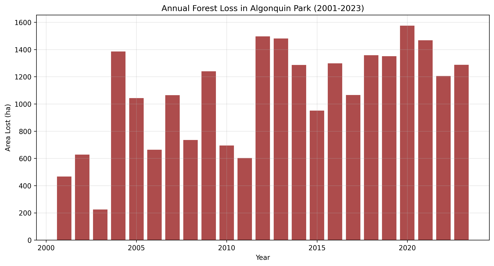
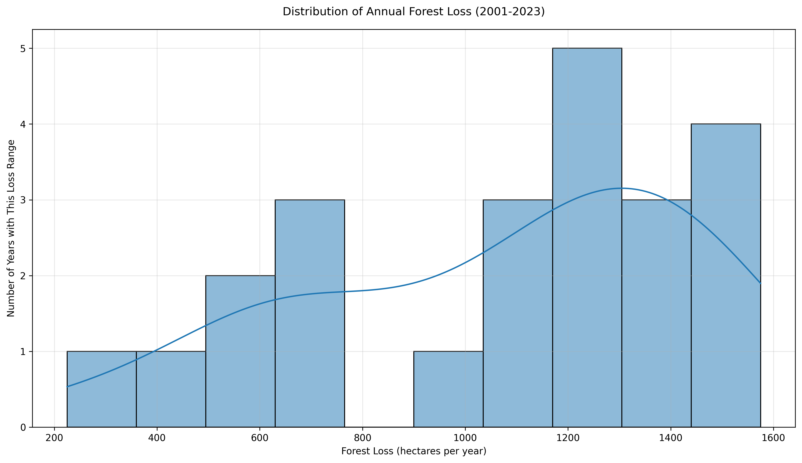
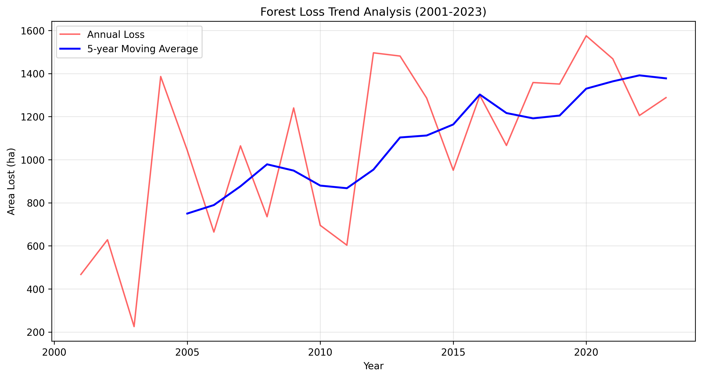

# Progress Report 2025
## Assessing the Potential for Ecosystem Services & Carbon Product Development

### Prepared For:
**Wildlands League**  
Suite 371, 401 Richmond St. W.  
Toronto, ON M5V 3A8  
Canada  
CRA Non Profit Number: 118782317RR0001

**Primary Contact:**  
Janet Sumner  
Executive Director  
janet@wildlandsleague.org

### Prepared By:
**OpenForests UG (haftungsbeschränkt)**  
Moerser Straße 171  
47803 Krefeld  
Germany

### Project Team:
**OpenForests Team:**
- **Project Director:** Alexander Watson
- **Project Manager:** Mange Kumarasamy
- **GIS Specialist:** Johan Karlsson

**Wildlands League Team:**
- **Executive Sponsor:** Janet Sumner
- **Technical Advisor:** [To be assigned]
- **Field Coordinator:** [To be assigned]

### Document Information:
- **Report Type:** Progress Report
- **Project Period:** 2025
- **Version:** 1.0
- **Date:** [Current Date]
- **Status:** In Progress
- **Reference Number:** WL-ES-2025-001

### Document History:
| Version | Date | Description | Author | Reviewer |
|---------|------|-------------|---------|-----------|
| 1.0 | [Current Date] | Initial Draft | Johan Karlsson | Alexander Watson |

### Distribution List:
| Name | Organization | Role | Contact |
|------|--------------|------|---------|
| Janet Sumner | Wildlands League | Executive Director | janet@wildlandsleague.org |
| Alexander Watson | OpenForests | Project Director | alexander.watson@openforests.com |
| Mange Kumarasamy | OpenForests | Project Manager | mange.kumarasamy@openforests.com |
| Johan Karlsson | OpenForests | GIS Specialist | johan.karlsson@openforests.com |

### Project Communication Structure:
**Primary Contacts:**
- **Project Management:** Mange Kumarasamy (mange.kumarasamy@openforests.com)
- **Technical Direction:** Alexander Watson (alexander.watson@openforests.com)
- **GIS & Spatial Analysis:** Johan Karlsson (johan.karlsson@openforests.com)
- **Client Representative:** Janet Sumner (janet@wildlandsleague.org)

**Communication Protocols:**
- Project status updates: Weekly
- Technical reviews: Bi-weekly
- Client meetings: Monthly
- Formal progress reports: Quarterly

### Abbreviations and Acronyms
- **GIS:** Geographic Information System
- **ES:** Ecosystem Services
- **WL:** Wildlands League
- **OF:** OpenForests
[To be expanded as needed]

<!-- Start of TOC page -->

# Table of Contents {.toc-header}

1. [Executive Summary](#1-executive-summary)
   - [Project Overview](#project-overview)
   - [Key Findings to Date](#key-findings-to-date)
   - [Current Status](#current-status)
   - [Next Steps](#next-steps)

2. [Pre-Assessment Analysis](#2-pre-assessment-analysis)
   - [Historical Land-use Assessment](#21-historical-land-use-assessment)
   - [Initial Feasibility Assessment](#22-initial-feasibility-assessment)

3. [Carbon Forest Mapping](#3-carbon-forest-mapping)
   - [Methodology](#31-methodology)
     - [Data Sources](#data-sources)
     - [Dataset Comparison](#dataset-comparison)
     - [Analysis Framework](#analysis-framework)
   - [Land Cover Classification](#32-land-cover-classification)

4. [Reference Area Analysis](#4-reference-area-analysis)
5. [Infrastructure Analysis](#5-infrastructure-analysis)
6. [Carbon Stock Assessment](#6-carbon-stock-assessment)
7. [Certification Strategy](#7-certification-strategy)
8. [Economic Analysis](#8-economic-analysis)
9. [Implementation Plan](#9-implementation-plan)
10. [Monitoring and Reporting](#10-monitoring-and-reporting)
11. [Risk Management](#11-risk-management)
12. [Conclusions and Recommendations](#12-conclusions-and-recommendations)

<!-- End of TOC page -->

## 1. Executive Summary
### Project Overview
The Wildlands League Ecosystem Services Project focuses on Algonquin Provincial Park, a Canadian icon that contains the highest concentration of self-sustaining trout lakes in the world and anchors the southern range of many of Ontario's large mammal species. The park forms the headwaters for four major rivers and sustains remnants of the original forest that covered central Ontario. This comprehensive analysis aims to assess and quantify the ecosystem services and carbon sequestration potential of these critical forested areas.

The project combines historical land-use assessment, carbon forest mapping, and infrastructure analysis to develop a robust framework for ecosystem service valuation and carbon credit development. This work is particularly significant given the park's ecological importance and the ongoing challenges it faces, including logging activities and infrastructure development. The analysis utilizes state-of-the-art remote sensing data and spatial analysis techniques to provide accurate and detailed insights into forest dynamics and carbon stocks, supporting conservation efforts and sustainable management of this vital ecosystem.

### Key Findings to Date
1. **Forest Cover Analysis:**
   - Total forest area: 635,643 hectares (83.5% of study area)
   - Stable forest cover maintained from 2000-2020
   - Disturbed forest areas: 18,651 hectares (2.4%)
   - Net forest change: +32 hectares (2000-2020)

2. **Deforestation Trends:**
   - Total forest loss (2001-2023): 23,573 hectares
   - Average annual loss: 1,025 hectares
   - Peak loss year: 2020 (1,575 hectares)
   - Increasing trend in annual forest loss

3. **Forest Dynamics:**
   - Significant areas of forest regeneration identified
   - Disturbance patterns mapped and categorized
   - Clear spatial patterns of forest change established

### Current Status
The project has successfully completed the Pre-Assessment Package, including:
- Historical land-use analysis (2000-2023)
- Forest cover mapping and classification
- Initial carbon stock assessment
- Infrastructure analysis framework

The Carbon Forest Maps Package is currently in progress, with:
- Detailed forest type classification completed
- Forest dynamics analysis underway
- Carbon stock modeling in development

### Next Steps
1. **Complete Carbon Forest Maps Package:**
   - Finalize forest type classification
   - Complete carbon stock assessment
   - Develop carbon sequestration models

2. **Begin Reference Area Analysis:**
   - Define reference areas
   - Conduct comparative analysis
   - Assess leakage risks

3. **Advance Infrastructure Analysis:**
   - Complete detailed infrastructure mapping
   - Assess impact on carbon stocks
   - Develop mitigation strategies

4. **Prepare for Certification:**
   - Select appropriate certification standard
   - Develop monitoring framework
   - Prepare documentation requirements

## 2. Pre-Assessment Analysis
### 2.1 Historical Land-use Assessment
#### Deforestation Trends (Updated 22.04.2025)

**Key Findings:**
1. **Total Forest Loss (2001-2023):**
   - Cumulative loss: 23,573 hectares
   - Average annual loss: 1,025 hectares
   - Peak loss year: 2020 (1,575 hectares)
   - Minimum loss year: 2003 (225 hectares)

2. **Loss Patterns by Period:**
   - 2001-2005: 3,749 hectares
   - 2006-2010: 4,398 hectares
   - 2011-2015: 5,817 hectares
   - 2016-2020: 6,648 hectares
   - 2021-2023: 3,961 hectares

3. **Trend Analysis:**
   - Increasing trend in annual forest loss
   - Average increase of approximately 35 hectares per year
   - Most significant losses observed in the 2016-2020 period

**Visualization Analysis:**

**Figure 1:** Annual forest loss in Algonquin Park from 2001 to 2023, showing the year-by-year variation in forest loss area (hectares). The bar chart reveals significant fluctuations in annual loss rates, with notable peaks in 2020 (1,575 ha) and 2012 (1,496 ha), and the lowest loss recorded in 2003 (225 ha).

**Figure 2:** Statistical distribution of annual forest loss rates (2001-2023). The histogram and density curve illustrate the frequency of different loss ranges, showing that most years experienced losses between 800-1,400 hectares, with fewer instances of extreme low (<400 ha) or high (>1,500 ha) annual losses.

**Figure 3:** Trend analysis of forest loss (2001-2023) with 5-year moving average. The red line shows annual variations while the blue line (moving average) reveals the underlying trend, demonstrating a gradual increase in forest loss rates over the study period, particularly after 2010.

**Analysis Implications:**
1. The temporal pattern shows considerable year-to-year variability in forest loss rates.
2. There is a discernible upward trend in forest loss over the study period, as evidenced by the moving average.
3. The distribution analysis reveals that while extreme loss events are rare, there is a consistent pattern of annual forest loss averaging around 1,025 hectares.
4. Recent years (2016-2023) show higher and more consistent loss rates compared to earlier periods.

These findings suggest a need for:
- Enhanced forest protection measures, particularly in recent high-loss areas
- Investigation of factors driving increased loss rates in recent years
- Development of targeted interventions for areas showing consistent loss patterns

### 2.2 Initial Feasibility Assessment

#### Carbon Credit Development Potential
Based on the forest cover analysis:
- Stable forest area: 635,643 hectares (83.5% of total area)
- Disturbed forest: 18,651 hectares (2.4%)
- Recent loss areas: 2,739 hectares (0.4%)
- Gain areas: 2,771 hectares (0.4%)

This distribution suggests significant potential for:
1. Forest conservation credits (REDD+)
2. Forest restoration in disturbed areas
3. Enhanced forest management in stable forest areas

## 3. Carbon Forest Mapping
### 3.1 Methodology

#### Data Sources
1. **Hansen Global Forest Change v1.11 (2000-2023)**
   - 30m resolution
   - Annual forest loss
   - Forest gain (2000-2012)
   - Tree cover (2000)
   - Canadian definition applied:
     - Minimum canopy cover: 25%
     - Minimum area: 1 hectare
     - Minimum height potential: 5 meters

2. **GLAD Forest Type Classification (2000-2020)**
   - Stable forest extent
   - Forest dynamics
   - Disturbance patterns
   - Canadian definition applied:
     - Minimum height: 5 meters
     - Minimum area: 1 hectare
     - Crown cover: ≥25%

#### Dataset Comparison
The analysis utilizes two complementary datasets, each with unique strengths:

1. **Hansen Global Forest Change v1.11 (2000-2023)**
   - **Time Coverage:** 2000-2023 (more recent)
   - **Original Definition:** 30% tree cover threshold
   - **Key Features:**
     - Annual forest loss data (2001-2023)
     - Forest gain data (2000-2012)
     - Tree cover baseline (2000)
     - Focuses on binary forest/non-forest changes
   - **Strengths:**
     - More recent data (up to 2023)
     - Annual resolution for loss
     - Well-established dataset with long history

2. **GLAD Forest Type Classification (2000-2020)**
   - **Time Coverage:** 2000-2020
   - **Original Definition:** ≥5m height threshold
   - **Key Features:**
     - Forest height information
     - More detailed forest dynamics:
       - Stable forest
       - Disturbed forest
       - Height changes
     - Includes forest quality aspects
   - **Strengths:**
     - More comprehensive forest definition
     - Includes forest structure information
     - Better for assessing forest quality

**Key Differences in Analysis:**
1. **Time Period:**
   - Hansen provides more recent data (up to 2023)
   - GLAD provides more detailed forest structure information

2. **Forest Change Detection:**
   - Hansen: Focuses on complete loss/gain
   - GLAD: Includes partial changes and disturbances

3. **Height Information:**
   - GLAD: Provides actual height measurements
   - Hansen: Based on canopy cover percentage

4. **Disturbance Classification:**
   - GLAD: Specifically identifies disturbed forests
   - Hansen: Only shows complete loss

**Interpretation Notes:**
- Both datasets were standardized using Canadian forest definition
- Numbers may differ slightly due to different detection methods
- GLAD provides more detailed forest quality information
- Hansen provides more recent and annual change data

#### Analysis Framework
1. **Pre-processing:**
   - Projection: EPSG:3161 (Chile Zone 3)
   - Resolution: 30 meters
   - Water body masking
   - Land area calculation

2. **Forest Definition Criteria (Canadian Standard):**
   - Minimum canopy cover: 25%
   - Minimum area: 1 hectare
   - Minimum height potential: 5 meters

3. **Classification System:**
   - Stable Forest
   - Forest Loss
   - Forest Gain
   - Disturbed Forest
   - Non-Forest
   - Water Bodies

4. **Analysis Tools:**
   - Google Earth Engine (primary analysis)
   - Python (statistical analysis)
   - QGIS (spatial visualization)

### 3.2 Land Cover Classification

#### Current Forest Status (2020)
1. **Stable Forest:**
   - Area: 635,643 hectares
   - Percentage: 83.5%
   - Characteristics: Continuous forest cover since 2000

2. **Disturbed Forest:**
   - Area: 18,651 hectares
   - Percentage: 2.4%
   - Types: Partial canopy loss, degradation

3. **Forest Dynamics:**
   - Loss areas: 2,739 hectares (0.4%)
   - Gain areas: 2,771 hectares (0.4%)
   - Net change: +32 hectares

**Figure 4:** Forest Cover Distribution (2020) - This map displays the forest cover distribution in 2020, derived from the GLAD dataset. It highlights areas of stable forest cover that persisted from 2000 to 2020, providing a current baseline for carbon stock assessment and conservation planning. The 30-meter resolution enables detailed analysis of forest patterns and supports the identification of priority areas for ecosystem services.

**Figure 5:** Forest Loss Patterns (2000-2020) - This map illustrates forest dynamics from 2000 to 2020 using the GLAD Global Land Cover and Land Use Change dataset. It shows areas of forest loss, where tree height decreased by ≥50% or where forest cover was completely removed. The 30-meter resolution data enables precise tracking of forest changes, supporting the assessment of carbon stock variations and conservation priorities.

**Figure 6:** Forest Regeneration (2000-2020) - This map displays areas of forest gain from 2000 to 2020 using the GLAD Global Land Cover and Land Use Change dataset. It highlights locations where forest extent increased or where tree height grew by ≥100%, indicating natural regeneration or afforestation. The 30-meter resolution enables detailed monitoring of forest recovery, supporting carbon sequestration potential assessment and restoration planning.

**Figure 7:** Forest Disturbance Patterns (2000-2020) - This map identifies areas of forest degradation and disturbance from 2000 to 2020 using the GLAD Global Land Cover and Land Use Change dataset. It shows forests that maintained tree height ≥5m but experienced significant disturbance, highlighting areas where forest structure and carbon stocks may be compromised. The 30-meter resolution enables detailed analysis of disturbance patterns, supporting targeted conservation and restoration efforts.

#### Temporal Patterns
1. **Annual Loss Trends:**
   - Early period (2001-2005): Lower loss rates
   - Middle period (2006-2015): Moderate increase
   - Recent period (2016-2023): Highest loss rates
   - Notable peaks: 2012, 2013, 2020

2. **Spatial Distribution:**
   - Loss patterns vary by region
   - Clustered disturbance areas
   - Edge effects visible

## 4. Reference Area Analysis
### 4.1 Reference Area Definition
- Selection Criteria: [In Progress]
- Comparative Analysis: [In Progress]
- Ecological Similarities: [In Progress]

### 4.2 Leakage Belt Assessment
- Delineation Methodology: [In Progress]
- Risk Assessment: [In Progress]
- Monitoring Strategy: [In Progress]

## 5. Infrastructure Analysis

### 5.1 GIS Infrastructure
- Established QGIS project structure (07.04.2025)
  - Created organized directories for vector and raster data
  - Set up output folders for maps, analysis results, and reports
  - Added comprehensive documentation for project organization
  - Project file name: `wildlands_league_ecosystem_analysis.qgz`

### 5.1 Current Infrastructure
- Forest Roads: [In Progress]
- Skid Trails: [In Progress]
- Buildings and Facilities: [In Progress]

### 5.2 Planned Infrastructure
- Development Plans: [In Progress]
- Impact Assessment: [In Progress]
- Mitigation Strategies: [In Progress]

## 6. Carbon Stock Assessment
### 6.1 Current Carbon Stocks
- Above-ground Biomass: [In Progress]
- Below-ground Biomass: [In Progress]
- Total Carbon Storage: [In Progress]

### 6.2 Carbon Sequestration Potential
- Future Scenarios: [In Progress]
- Growth Projections: [In Progress]
- Enhancement Opportunities: [In Progress]

## 7. Certification Strategy
### 7.1 Standard Selection
- Methodology Comparison: [In Progress]
- Selection Criteria: [In Progress]
- Recommended Approach: [In Progress]

### 7.2 Certification Requirements
- Documentation Needs: [In Progress]
- Baseline Requirements: [In Progress]
- Monitoring Plans: [In Progress]

## 8. Economic Analysis
### 8.1 Financial Viability
- Cost-Benefit Analysis: [In Progress]
- Revenue Projections: [In Progress]
- Investment Requirements: [In Progress]

### 8.2 Market Analysis
- Carbon Credit Market Overview: [In Progress]
- Price Trends: [In Progress]
- Buyer Interest: [In Progress]

## 9. Implementation Plan
### 9.1 Project Timeline
- Key Milestones: [In Progress]
- Critical Path: [In Progress]
- Resource Requirements: [In Progress]

### 9.2 Stakeholder Engagement
- Communication Strategy: [In Progress]
- Consultation Process: [In Progress]
- Partnership Development: [In Progress]

## 10. Monitoring and Reporting
### 10.1 Monitoring Framework
- Key Performance Indicators: [In Progress]
- Measurement Protocols: [In Progress]
- Data Collection Methods: [In Progress]

### 10.2 Reporting Structure
- Regular Updates: [In Progress]
- Stakeholder Reports: [In Progress]
- Certification Requirements: [In Progress]

## 11. Risk Management
- Identified Risks: [In Progress]
- Mitigation Strategies: [In Progress]
- Contingency Plans: [In Progress]
- Monitoring Protocols: [In Progress]

## 12. Conclusions and Recommendations
- Key Findings: [In Progress]
- Strategic Recommendations: [In Progress]
- Next Steps: [In Progress]
- Long-term Vision: [In Progress]

## Appendices
### A. Detailed Maps
[To be added as analysis progresses]

### B. Technical Analysis Results
[To be added as analysis progresses]

### C. Stakeholder Consultation Records
[To be added as consultations occur]

### D. Methodology Documentation
[To be added as methodologies are implemented]

### E. Raw Data and Analysis Files
[To be added as data is collected and analyzed]

## Document Control
### Confidentiality Statement
This document contains confidential and proprietary information. It is provided under the terms of the agreement between Wildlands League and OpenForests UG (Haftungsbeschränkt). No part of this document may be disclosed or distributed to third parties without prior written consent from both parties.

### Quality Assurance
This document has been prepared in accordance with OpenForests' Quality Management System and has undergone appropriate review and approval processes.

### Reference Documents
1. Project Proposal (Version 1.0: 05.03.2025)
2. [Other relevant reference documents to be added]

---
**End of Document**